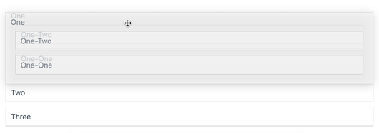

# SortableJS-vue3

[Demo](https://sortablejs-vue3.maxleiter.com) | [npm](https://www.npmjs.com/package/sortablejs-vue3)



This is a thin wrapper around the great [SortableJS](https://github.com/SortableJS/Sortable) library. I had many issues migrating from Vue.Draggable to vue.draggable.next, and after briefly investigating I decided that it was too complicated and a smaller solution was the answer. This wrapper attempts to keep you as close to Sortable as possible.

### Why not use \<other library\>?

- `Vue.Draggable` only supports Vue 2
- `vue.draggable.next` uses the Options API, has multiple open (and afaict useful) pull requests, and had weird bugs/side-effects when I tried and used it
- `shopify/draggable` and [`vue-shopify-dragable`](https://github.com/zjffun/vue-shopify-draggable) seemed promising but they don't supported nested components

## Usage

You can see a demo with more complete code at [https://sortablejs-vue3.maxleiter.com](https://sortablejs-vue3.maxleiter.com).

1. Install the package:

```bash
pnpm add sortablejs-vue3 sortablejs
```

or

```bash
npm install sortablejs-vue3 sortablejs
```

2. Import the component in your `<script setup>` (or `<script>`):

```typescript
import { Sortable } from "sortablejs-vue3";
```

3. Use the component:

```vue
<template>
  <main>
    <Sortable
      :list="elements"
      item-key="id"
      tag="div"
      :options="options"
    >
      <-- The Header and Footer templates below are optional -->
      <template #header>
          <header>
            <h1>SortableJS Vue3 Demo</h1>
          </header>
      </template>
      <template #item="{element, index}">
        <div class="draggable" :key="element.id">
          {{ element.name }}
        </div>
      </template>
      <template #footer>
          <footer class="draggable">A footer</footer>
      </template>
    </Sortable>
</template>
```

4. The `list` and `item-key` props are necessary. The `options` prop is an object that can contain any SortableJS option. You can find a full list of them here: https://github.com/SortableJS/Sortable#options
   - The `tag` prop is optional and defaults to `div`. It's the HTML node type for the outer element of the included template/slot.

### Props

- `list` (`Array<any>`, required): your data to list
- `itemKey` (`string` | `(item) => (string | number | Symbol)`, required): The name of the key present in each item in the list that corresponds to a unique value (to use as the `key`)
- `tag` (`string`, optional, default = `"div"`): The element type to render as
- `options` (`Object`, false): the SortableJS options minus event handlers (see below)

### Events

You can listen to Sortable events by adding the listeners to the `Sortable` component. For example:

```typescript
<Sortable
  :list="elements"
  item-key="id"
  @change="(event: Sortable.SortableEvent) => void"
  @choose="(event: Sortable.SortableEvent) => void"
  @unchoose="(event: Sortable.SortableEvent) => void"
  @start="(event: Sortable.SortableEvent) => void"
  @end="(event: Sortable.SortableEvent) => void"
  @add="(event: Sortable.SortableEvent) => void"
  @update="(event: Sortable.SortableEvent) => void"
  @sort="(event: Sortable.SortableEvent) => void"
  @remove="(event: Sortable.SortableEvent) => void"
  @filter="(event: Sortable.SortableEvent) => void"
  @move="(event: Sortable.MoveEvent, event2: Event) => void"
  @move.capture="(event: Sortable.MoveEvent, event2: Event) => boolean | -1 | 1"
  @clone="(event: Sortable.SortableEvent) => void"
>
```

### Using plugins

You need to mount any plugins you want outside of [the default](https://github.com/SortableJS/Sortable#plugins) before importing this library. For example, the below is correct:

```typescript
import SortableJs from "sortablejs";
import { Swap } from "sortablejs/modular/sortable.core.esm";
SortableJs.mount(new Swap());

import { Sortable } from "sortablejs-vue3";
```

### Use with a store

No changes are necessary to work with Vuex or another store. Just pass `store.state.items` as your list. To modify your data you need to manually listen to the events and calculate the new position with `event.oldIndex` and `event.newIndex` with something like the following:

```typescript
const moveItemInArray = <T>(array: T[], from: number, to: number) => {
  const item = array.splice(from, 1)[0];
  nextTick(() => array.splice(to, 0, item));
};

onEnd(event) { moveItemInArray(store.state.items, event.oldIndex, event.newIndex) }
```

You may also want to see the SortableJS store documentation [here](https://github.com/SortableJS/Sortable#store).

### Examples

- [./src/examples/WithStore.vue](./src/examples/WithStore.vue) - A simple example with a store

## Development

1. Run `pnpm` to install dependencies
2. `pnpm dev` will start a web server with live reloading
3. `pnpm build` will build the production library files
4. `pnpm build:site` will build the demo website

### Recommended IDE Setup

- [VS Code](https://code.visualstudio.com/) + [Volar](https://marketplace.visualstudio.com/items?itemName=Vue.volar)
